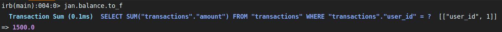
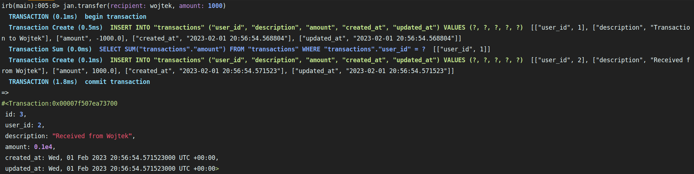
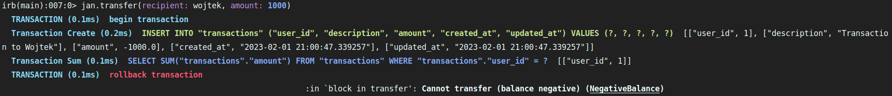

# Transakcje w Active Record

W dzisiejszym wpisie(a raczej notatki do samego siebie 💁), chciałbym poruszyć temat transakcji. Na pierwszy raz to słowo może wydawać się to trochę enigmatyczne, jednak po głębszym zagłębieniu się w dokumentacje, staję się na tyle zrozumiałe aby móc wypróbować transakcje w mini projekcie ([RTFM](https://pl.wikipedia.org/wiki/RTFM) zobowiązuję 😅).

# Czym są transakcje ?

Jak podaje definicja transakcje w Active Record są blokami kodu, które wykonają zapytanie SQL wtedy gdy spełni się jedna atomowa  akcja. Może z tym przetłumaczeniem jest jeszcze gorzej niż na początku, ale tłumacząc to na żywym przykładzie powinno być lepiej. 

 

# Transakcje - wykorzystanie

Doskonałym przykładem do opisania transakcji, może być aplikacja bankowa. Załóżmy w uproszczeniu, że nasza aplikacja pozwala na następujące akcje: wpłatę i wypłatę oraz przelew pieniędzy. Załóżmy, że mamy użytkowników o imionach Jan oraz Wojtek. Stan konta Jana wynosi 1500 PLN. Chciałby przelać Wojtkowi 1000 PLN (Faktura, haracz itp.). W tym przypadku operacja przebiegnie pomyślnie, a na koncie Janka zostanie 500 PLN, a co jeśli Jan będzie chciał jeszcze raz przelać 1000 PLN ? Nasza aplikacja nie powinna pozwolić na wykonanie takiej operacji, nie mówiąc już o zapisywaniu jej w bazie danych. W tym mogą pomóc na transakcje.

# Przykład użycia

Na początku wygenerujmy nową aplikacje


rails new transactions_exaple -t


- -t pozwoli nam pominąć stworzenie folderu z testami
- baza MYSQLite domyślnie

Następnie wygenerujmy model o nazwie User z imieniem oraz model o nazwie transaction z asocjacją do modelu user, description oraz amount


rails g model user name



rails g model transaction user:belongs_to description amount:decimal{8-2}


- decimal{8-2} oznacza, że precyzja wynosi 8 cyfr, a skala wynosi 2 cyfry (po przecinku) np. 999999.99

Teraz przejdźmy do folderu db i pliku seeds.rb stwórzmy przykładowe dane.


# db/seeds.rb

jan = User.create(name: "Jan")
wojtek = User.create(name: "Wojtek")

jan.transactions.create(description: "Initial Balance", amount: 1500)


W konsoli wykonujemy migrację oraz załadowanie naszych danych


rails db:migrate && rails db:seed


Przechodzimy do modelu user. Tworzymy asocjacje has_many względem transactions oraz tworzymy dwie funkcję. Jedna odpowiada za sprawdzenie stanu konta, a druga odpowiada za “przelew” środków do danej osoby (pierwsza funkcja zawiera dość sporę uproszczenie, ale na tym przykładzie to wystarczy. Najlepiej byłoby stworzyć kolejną pozycję do bazy danych o nazwie amount.). W drugiej funkcji użyjemy właśnie omawianych transakcji. 


# models/user.rb

class NegativeBalance < StandardError; end

class User < ApplicationRecord
  has_many :transactions

  def balance
    transactions.sum(:amount)
  end

  def transfer(recipient: nil, amount: 0)
    return if amount.zero?
    return unless recipient

    ActiveRecord::Base.transaction do
      transactions.create(description: "Transaction to #{recipient.name}", amount: -amount)
      raise NegativeBalance, "Cannot transfer (balance negative)" if balance.negative?
      recipient.transactions.create(description: "Received from #{recipient.name}", amount: amount)
    end
  end
end


Za pomocą ActiveRecord::Base.transaction tworzymy transakcje, która polega na tym, że podczas “przelewu” z konta nadawcy wartość konta zmniejsza się o daną kwotę podaną w parametrze funkcji transfer, z kolei odbiorcy balans konta zwiększa się o podaną ilość. Przelew nie ma dość do skutku w przypadku, w którym pobranie kwoty od nadawcy skutkowałoby ujemnym stanem konta. W tym przypadku stworzyliśmy własną klasę błędy, która dziedziczy po StandartError i “wyrzuca” błąd oraz cofa transakcję w wyżej wymienionym przypadku. Aby móc wypróbować to na żywo posłużymy się konsolą w rails.


rails c


Następnie przypisujemy naszych użytkowników do zmiennych.


jan = User.first
wojtek = User.last


Za pomocą funkcji balance możemy spradzić stan konta naszego użytkownika. Warto w tym przypadku jeszcze prze konwertować na liczby zmiennoprzecinkowe za pomocą to_f


jan.balance.to_f


A teraz przelejmy 1000 PLN innemu użytkownikowi. Użyjemy funkcni transfer parametrami nadawcy oraz kwoty jaką chcemy przelać.


jan.transfer(recipient: wojtek, amount: 1000)


Teraz sprawdźmy stan konta Wojtka


wojtek.balance.to_f


Wszystko jest jak należy. A spróbujmy jeszcze raz przelać 1000 PLN z konta Jana.

Przelew nie doszedł do skutku, ponieważ wykonanie tej operacji spowodowałoby ujemny bilans konta u Jana. 

# Podsumowanie

I tak oto prezentują się w uproszczeniu transakcje w praktycznym wykorzystaniu. Po nauce ich działania zauważyłem, że mogłem (a raczej powinienem) użyć ich w projekcie sklepu, który wcześniej napisałem. A chodzi mi o manipulowanie stanem magazynu, gdy użytkownik zamówi nowy towar. Aktualnie w projekcie jest to zrobione po najmniejszej linii oporu. Produkt jest odejmowany ze stanu gdy użytkownik doda go do koszyka. Teraz wiem, że wykorzystanie transakcji lepiej rozwiązało by tą mechanikę, ale to może temat na osobny wpis.